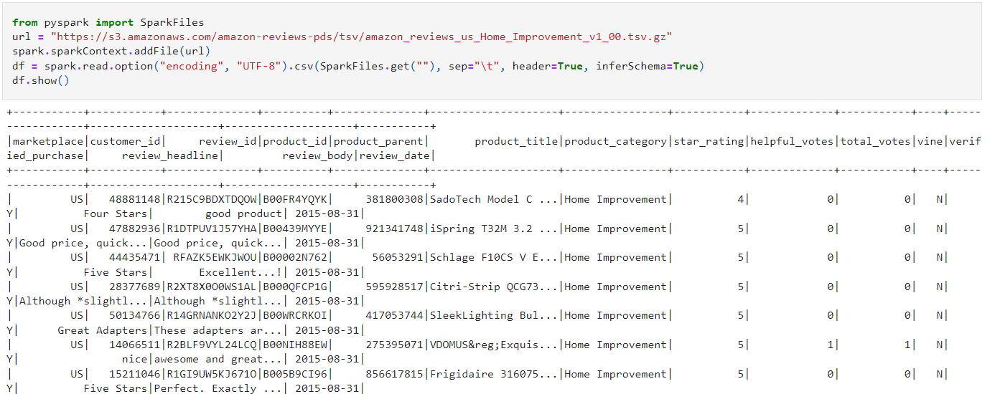
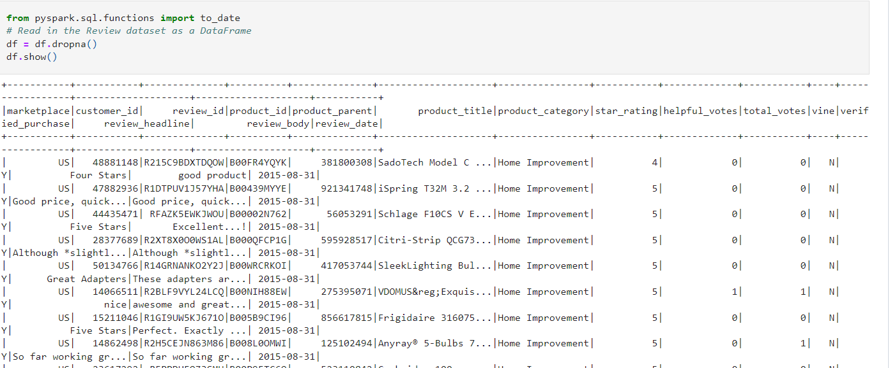
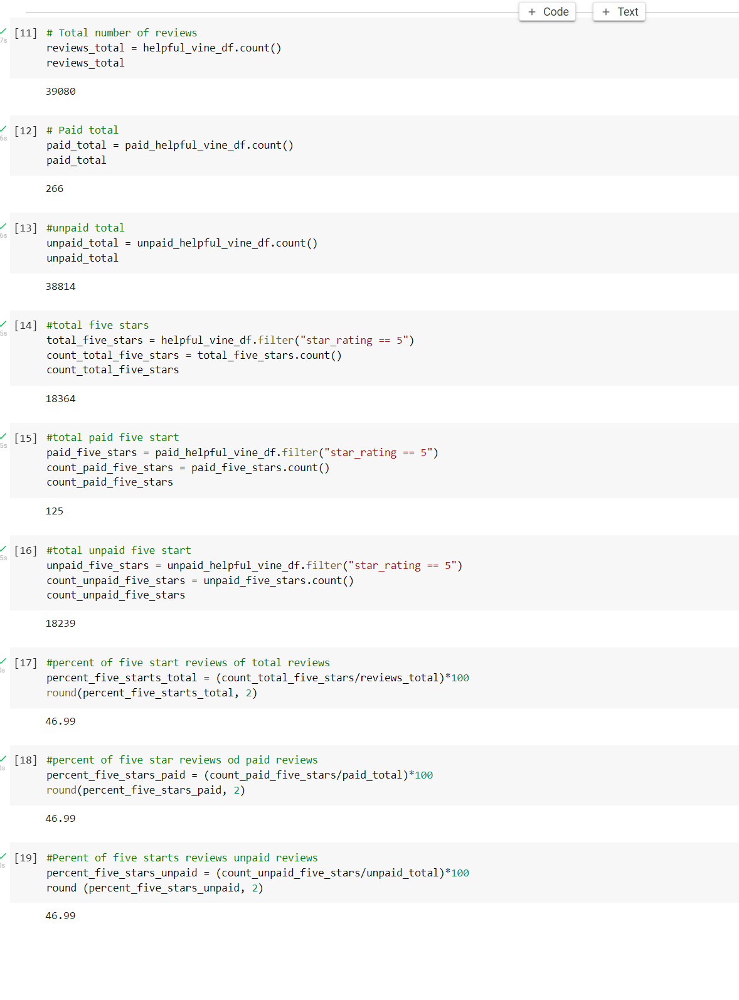

# Amazon_Vine_Analysis
## Overview
In this analysis we are employing power of big data to analyze reviews posted by paid vs unpaid reviewers and how it affects reviews and rating of products. Companies like SellBy pay a small fee to Amazon and provide products to Amazon Vine members, who are then required to publish a review. We are employing Pyspark, Pandas, and Postgres SQL to extract, transform and load (ETL) data to evaluate biases between paid and unpaid reviews. There were fifty different sets of data to select from. We have selected "home improvement" dataset. 
We extracted data using Spark and loaded it to Google Colab. Then loaded into pandas dataframe.

### Transform
Transform has many steps. 
1. Dropped column with null values, and duplicates
2. Created dataframe to match sql tables 
### Load 
Using Postgres SQL on AWS we uploaded the data to cloud based SQL database. 

## Analysis and Results 
Once database was created with cleaned data it was time to analyze data to see if paying for reviews cause bias in ratings. That was accomplished by checking if there is any difference of percentage positive in home improvement reviews between paid and unpaid review. The results were found by number of five star reviews divided by number of total reviews and then multiplying by 100.   
The results were so close that I had to check a few times to make sure my formula is correct. When rounded to two decimal points the results were same. Therefore, we fail to reject null hypothesis in case of home improvement reviews on Amazon. Paying for a review does not affect the rating of the review. 

## Summary 
The five-star review percentage point were so close in all cases that I had to check few times before confirming that I got the case right. Number of paid reviews is fairly small compared to rest of the data. However, it is the population, and not sample, we are analyzing there is no margin of error. In this particular case paying for reviews did not play any part.   

